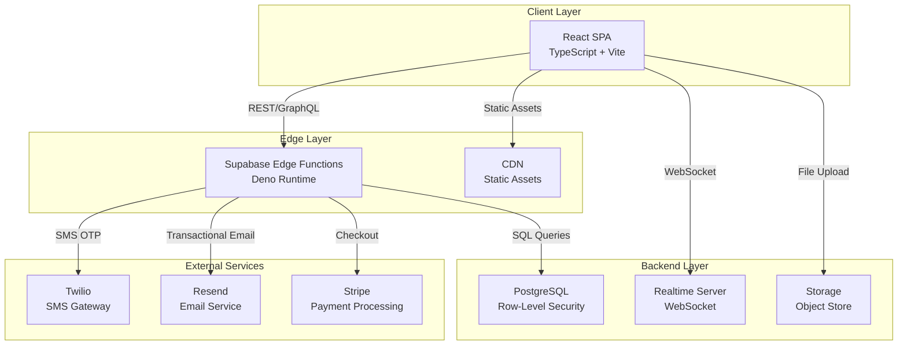

# AuraUp

<div align="center">


[](https://www.typescriptlang.org/)
[](https://reactjs.org/)
[](https://supabase.com/)
[](LICENSE)
[](CONTRIBUTING.md)

**Enterprise-grade professional development and personal branding platform**

[Live Demo](https://auraup.app) · [Documentation](https://docs.auraup.app) · [Report Bug](https://github.com/auraup/issues) · [Request Feature](https://github.com/auraup/issues)

</div>

---

## 📋 Table of Contents

- [Overview](#-overview)
- [Key Features](#-key-features)
- [Architecture](#-architecture)
- [Technology Stack](#-technology-stack)
- [Getting Started](#-getting-started)
- [Project Structure](#-project-structure)
- [Configuration](#-configuration)
- [Development](#-development)
- [Deployment](#-deployment)
- [API Documentation](#-api-documentation)
- [Security](#-security)
- [Performance](#-performance)
- [Contributing](#-contributing)
- [License](#-license)

---

## 🎯 Overview

AuraUp is a production-ready, scalable professional development platform that combines modern web technologies with intelligent user experience design. Built with enterprise security standards and performance optimization, it delivers a seamless learning and networking experience.

### Design Philosophy

- **Security First**: Multi-layer authentication with 2FA, audit logging, and RLS
- **Performance Optimized**: Lighthouse scores 90+, sub-2s load times
- **Accessibility Compliant**: WCAG 2.1 AA standards, keyboard navigation
- **Developer Experience**: Type-safe, well-documented, modular architecture
- **Scalability**: Microservices-ready, horizontal scaling support

---

## ✨ Key Features

### 🔐 Authentication & Security
- **Multi-factor Authentication**
  - SMS OTP via Twilio
  - TOTP (RFC 6238) with QR code provisioning
  - OAuth 2.0 (Google, GitHub, Facebook)
- **Session Management**
  - JWT-based tokens with refresh rotation
  - Concurrent session control
  - Automatic session expiry and renewal
- **Security Monitoring**
  - Real-time audit logging
  - Anomaly detection and alerts
  - IP-based rate limiting

### 🎨 Dynamic Experience Engine
```typescript
// Adaptive UI that evolves with user engagement
const experience = {
  themes: 5,        // Color schemes with semantic tokens
  layouts: 4,       // Hero and grid variations
  animations: 4,    // Motion presets (calm → expressive)
  content: 50+      // Dynamic text pools
};
```
- Session-based variation without user fatigue
- A/B testing framework ready
- Analytics-driven personalization hooks

### 📚 AuraLearn Platform
- Interactive course builder with drag-and-drop
- Code playground with syntax highlighting
- Progress tracking with gamification
- Certificate generation and verification
- Adaptive learning paths

### 💬 ThinkSpace Community
- Rich text editor (Markdown + WYSIWYG)
- Real-time collaborative editing
- Comment threads with moderation
- Content recommendation engine
- Social sharing and bookmarking

### 📊 Analytics Dashboard
- Real-time performance metrics
- Learning analytics and insights
- Engagement heatmaps
- Custom report generation
- Export to CSV/PDF

---

## 🏗 Architecture

### High-Level System Design



### Component Architecture

```
┌─────────────────────────────────────────────────────────────┐
│                      Application Shell                       │
├─────────────────────────────────────────────────────────────┤
│  ┌───────────────────────────────────────────────────────┐  │
│  │         Context Providers (Composition Pattern)        │  │
│  │  - AuthProvider (Session, Permissions)                │  │
│  │  - ThemeProvider (Dark/Light, Tokens)                 │  │
│  │  - DynamicExperienceProvider (Variation Engine)       │  │
│  │  - QueryClientProvider (Cache, Sync)                  │  │
│  └───────────────────────────────────────────────────────┘  │
├─────────────────────────────────────────────────────────────┤
│  ┌───────────────────────────────────────────────────────┐  │
│  │              Layout Components                         │  │
│  │  - GlobalNavigation (Sticky, A11y)                    │  │
│  │  - DashboardPanel (Slide-in, Lazy)                    │  │
│  │  - Footer (Sitemap, Legal)                            │  │
│  └───────────────────────────────────────────────────────┘  │
├─────────────────────────────────────────────────────────────┤
│  ┌───────────────────────────────────────────────────────┐  │
│  │           Page Components (Route-based)                │  │
│  │  - Code splitting via React.lazy()                    │  │
│  │  - Suspense boundaries with fallbacks                 │  │
│  │  - Error boundaries with retry logic                  │  │
│  └───────────────────────────────────────────────────────┘  │
└─────────────────────────────────────────────────────────────┘
```

### State Management Strategy

| State Type | Solution | Use Case |
|------------|----------|----------|
| **Server State** | TanStack Query | API data, cache invalidation |
| **UI State** | React Context + useReducer | Theme, sidebar, modals |
| **Form State** | React Hook Form + Zod | Validation, submissions |
| **URL State** | React Router | Navigation, filters |
| **Global State** | Zustand (optional) | Cross-cutting concerns |

---

## 🛠 Technology Stack

### Frontend Core

```json
{
  "runtime": {
    "react": "^18.2.0",
    "typescript": "^5.3.0"
  },
  "build": {
    "vite": "^5.0.0",
    "@vitejs/plugin-react": "^4.2.0"
  },
  "styling": {
    "tailwindcss": "^3.4.0",
    "autoprefixer": "^10.4.16",
    "postcss": "^8.4.32"
  }
}
```

### State & Data

| Package | Version | Purpose |
|---------|---------|---------|
| `@tanstack/react-query` | ^5.14.0 | Server state, caching |
| `react-router-dom` | ^6.21.0 | Client-side routing |
| `react-hook-form` | ^7.49.0 | Form management |
| `zod` | ^3.22.0 | Schema validation |
| `zustand` | ^4.4.7 | Lightweight state (optional) |

### Animation & Graphics

| Package | Version | Purpose |
|---------|---------|---------|
| `framer-motion` | ^10.16.0 | Component animations |
| `gsap` | ^3.12.0 | Scroll animations |
| `three` | ^0.160.0 | 3D graphics |
| `@react-three/fiber` | ^8.15.0 | React renderer for Three.js |
| `@react-three/drei` | ^9.92.0 | Three.js helpers |

### UI Components

| Package | Version | Purpose |
|---------|---------|---------|
| `@radix-ui/react-*` | ^1.0.0 | Headless primitives |
| `lucide-react` | ^0.303.0 | Icon library |
| `class-variance-authority` | ^0.7.0 | Component variants |
| `tailwind-merge` | ^2.2.0 | Class merging utility |

### Backend Services

```yaml
platform: Supabase
database: PostgreSQL 15
auth: Supabase Auth
storage: Supabase Storage
realtime: WebSocket Server
edge_functions: Deno 1.39
```

### External APIs

| Service | Purpose | Documentation |
|---------|---------|---------------|
| **Twilio** | SMS OTP delivery | [API Docs](https://www.twilio.com/docs/sms) |
| **Resend** | Transactional emails | [API Docs](https://resend.com/docs) |
| **Stripe** | Payment processing | [API Docs](https://stripe.com/docs/api) |

---

## 🚀 Getting Started

### Prerequisites

Ensure you have the following installed:

- **Node.js**: >= 18.0.0 ([Download](https://nodejs.org/))
- **npm**: >= 9.0.0 (comes with Node.js)
- **Git**: >= 2.40.0 ([Download](https://git-scm.com/))
- **Supabase CLI**: >= 1.123.0 ([Install](https://supabase.com/docs/guides/cli))

### Installation

```bash
# 1. Clone the repository
git clone https://github.com/your-org/auraup.git
cd auraup

# 2. Install dependencies
npm install

# 3. Copy environment variables
cp .env.example .env.local

# 4. Start Supabase local development
supabase start

# 5. Run database migrations
supabase db push

# 6. Start development server
npm run dev
```

The application will be available at `http://localhost:5173`

### Quick Start with Docker

```bash
# Start all services with Docker Compose
docker-compose up -d

# View logs
docker-compose logs -f

# Stop services
docker-compose down
```

---

## 📁 Project Structure

```
auraup/
├── .github/                      # GitHub Actions workflows
│   ├── workflows/
│   │   ├── ci.yml                # Continuous Integration
│   │   ├── cd.yml                # Continuous Deployment
│   │   └── codeql.yml            # Security scanning
│
├── public/                       # Static assets (served as-is)
│   ├── fonts/                    # Self-hosted fonts
│   ├── images/                   # Optimized images
│   ├── robots.txt                # SEO crawler config
│   └── sitemap.xml               # SEO sitemap
│
├── src/
│   ├── assets/                   # Build-time processed assets
│   │   ├── icons/                # SVG icons
│   │   └── images/               # Source images
│   │
│   ├── components/               # React components
│   │   ├── animations/           # Reusable animation wrappers
│   │   │   ├── AnimatedButton.tsx
│   │   │   ├── AnimatedCard.tsx
│   │   │   ├── FadeInWhenVisible.tsx
│   │   │   ├── PageTransition.tsx
│   │   │   └── ParallaxBackground.tsx
│   │   │
│   │   ├── auth/                 # Authentication components
│   │   │   ├── LoginForm.tsx
│   │   │   ├── SignupForm.tsx
│   │   │   ├── OTPVerification.tsx
│   │   │   ├── ProtectedRoute.tsx
│   │   │   └── TwoFactorSetup.tsx
│   │   │
│   │   ├── dashboard/            # Dashboard widgets
│   │   │   ├── DashboardPanel.tsx
│   │   │   ├── PerformanceAnalytics.tsx
│   │   │   ├── ProfileOverview.tsx
│   │   │   └── QuickLinks.tsx
│   │   │
│   │   ├── home/                 # Homepage sections
│   │   │   ├── HeroSection.tsx
│   │   │   ├── FeaturedContent.tsx
│   │   │   ├── QuickAccessTools.tsx
│   │   │   └── TrendingContent.tsx
│   │   │
│   │   ├── layout/               # Layout components
│   │   │   ├── GlobalNavigation.tsx
│   │   │   ├── Footer.tsx
│   │   │   └── PageLayout.tsx
│   │   │
│   │   ├── logo/                 # Brand identity
│   │   │   ├── AuraUpLogo.tsx    # Animated 3D logo
│   │   │   └── LogoFallback.tsx  # Static SVG fallback
│   │   │
│   │   └── ui/                   # Shadcn/ui components
│   │       ├── button.tsx
│   │       ├── card.tsx
│   │       ├── dialog.tsx
│   │       └── ...
│   │
│   ├── context/                  # React Context providers
│   │   ├── AuthContext.tsx
│   │   ├── ThemeContext.tsx
│   │   └── DynamicExperienceContext.tsx
│   │
│   ├── hooks/                    # Custom React hooks
│   │   ├── useAuth.tsx
│   │   ├── useCustomAuth.tsx
│   │   ├── use2FA.tsx
│   │   ├── useDebounce.ts
│   │   ├── useMediaQuery.ts
│   │   ├── useReducedMotion.ts
│   │   └── use-toast.ts
│   │
│   ├── lib/                      # Utility libraries
│   │   ├── animations.ts         # GSAP/Framer configs
│   │   ├── dynamicContent.ts     # Content variation system
│   │   ├── seo.ts                # SEO utilities
│   │   ├── utils.ts              # General utilities
│   │   └── validations/          # Zod schemas
│   │       ├── auth.ts
│   │       ├── course.ts
│   │       └── profile.ts
│   │
│   ├── pages/                    # Route components
│   │   ├── Index.tsx             # Homepage
│   │   ├── Auth.tsx              # Auth flow
│   │   ├── Dashboard.tsx         # User dashboard
│   │   ├── AuraLearn.tsx         # Learning platform
│   │   ├── ThinkSpace.tsx        # Community
│   │   └── ...
│   │
│   ├── services/                 # API services
│   │   ├── api.ts                # Base API client
│   │   ├── auth.service.ts
│   │   ├── course.service.ts
│   │   └── user.service.ts
│   │
│   ├── types/                    # TypeScript definitions
│   │   ├── api.types.ts
│   │   ├── auth.types.ts
│   │   └── user.types.ts
│   │
│   ├── App.tsx                   # Root component
│   ├── main.tsx                  # Entry point
│   └── index.css                 # Global styles
│
├── supabase/
│   ├── config.toml               # Supabase configuration
│   ├── functions/                # Edge Functions (Deno)
│   │   ├── _shared/              # Shared utilities
│   │   │   ├── cors.ts
│   │   │   ├── supabase.ts
│   │   │   └── validation.ts
│   │   ├── auth-signup/
│   │   ├── auth-signin/
│   │   ├── auth-verify-otp/
│   │   ├── twofactor-generate/
│   │   └── ...
│   ├── migrations/               # Database migrations
│   │   ├── 20240101000000_initial_schema.sql
│   │   ├── 20240115000000_add_2fa.sql
│   │   └── ...
│   └── seed.sql                  # Development seed data
│
├── .env.example                  # Environment variables template
├── .eslintrc.cjs                 # ESLint configuration
├── .prettierrc                   # Prettier configuration
├── docker-compose.yml            # Docker services
├── Dockerfile                    # Production container
├── package.json                  # Dependencies
├── tailwind.config.ts            # Tailwind configuration
├── tsconfig.json                 # TypeScript configuration
├── vite.config.ts                # Vite configuration
└── README.md                     # This file
```

---

## ⚙️ Configuration

### Environment Variables

Create `.env.local` in the project root:

```bash
# Supabase
VITE_SUPABASE_URL=https://your-project.supabase.co
VITE_SUPABASE_ANON_KEY=eyJhbGciOiJIUzI1NiIsInR5cCI6IkpXVCJ9...

# Application
VITE_APP_NAME=AuraUp
VITE_APP_URL=http://localhost:5173
VITE_API_BASE_URL=https://your-project.supabase.co/functions/v1

# Feature Flags
VITE_ENABLE_ANALYTICS=true
VITE_ENABLE_2FA=true
VITE_ENABLE_OAUTH=true

# External Services (Edge Functions only)
TWILIO_ACCOUNT_SID=ACxxxxxxxxxxxxxxxxxxxxxxxxxxxxxxxx
TWILIO_AUTH_TOKEN=your_auth_token
TWILIO_PHONE_NUMBER=+1234567890
RESEND_API_KEY=re_xxxxxxxxxxxxxxxxxxxxxxxxxxxx
STRIPE_SECRET_KEY=sk_test_xxxxxxxxxxxxxxxxxxxxxxxxxxxx
```

### Supabase Secrets

Add via Supabase Dashboard → Settings → Edge Functions → Secrets:

```bash
supabase secrets set TWILIO_ACCOUNT_SID=ACxxxxx
supabase secrets set TWILIO_AUTH_TOKEN=xxxxx
supabase secrets set TWILIO_PHONE_NUMBER=+1234567890
supabase secrets set RESEND_API_KEY=re_xxxxx
supabase secrets set STRIPE_SECRET_KEY=sk_test_xxxxx
```

### OAuth Configuration

#### Google OAuth
1. Go to [Google Cloud Console](https://console.cloud.google.com/)
2. Create OAuth 2.0 Client ID
3. Add authorized redirect URI: `https://your-project.supabase.co/auth/v1/callback`
4. Add Client ID and Secret to Supabase Dashboard → Authentication → Providers

#### GitHub OAuth
1. Go to [GitHub Developer Settings](https://github.com/settings/developers)
2. Create new OAuth App
3. Set callback URL: `https://your-project.supabase.co/auth/v1/callback`
4. Add Client ID and Secret to Supabase Dashboard

---

## 🔨 Development

### Available Scripts

```bash
# Development
npm run dev              # Start dev server with HMR
npm run dev:host         # Start dev server with network access

# Building
npm run build            # Production build
npm run preview          # Preview production build locally

# Code Quality
npm run lint             # Run ESLint
npm run lint:fix         # Fix ESLint errors
npm run format           # Format with Prettier
npm run typecheck        # TypeScript type checking

# Testing
npm run test             # Run unit tests
npm run test:ui          # Run tests with UI
npm run test:coverage    # Generate coverage report

# Database
npm run db:reset         # Reset local database
npm run db:seed          # Seed development data
npm run db:migration     # Create new migration
```

### Development Workflow

1. **Create Feature Branch**
   ```bash
   git checkout -b feature/your-feature-name
   ```

2. **Make Changes**
   - Follow [Conventional Commits](https://www.conventionalcommits.org/)
   - Run `npm run lint` before committing
   - Write tests for new features

3. **Test Locally**
   ```bash
   npm run test
   npm run build
   npm run preview
   ```

4. **Push and Create PR**
   ```bash
   git push origin feature/your-feature-name
   ```

### Code Style Guidelines

#### TypeScript
```typescript
// ✅ Good: Explicit types, descriptive names
interface UserProfile {
  id: string;
  email: string;
  fullName: string;
  avatarUrl: string | null;
}

const fetchUserProfile = async (userId: string): Promise<UserProfile> => {
  // Implementation
};

// ❌ Bad: Any types, unclear names
const getUser = async (id: any): Promise<any> => {
  // Implementation
};
```

#### React Components
```tsx
// ✅ Good: Named exports, TypeScript props, JSDoc
interface ButtonProps extends React.ButtonHTMLAttributes<HTMLButtonElement> {
  variant?: 'primary' | 'secondary';
  isLoading?: boolean;
}

/**
 * Reusable button component with loading state
 */
export function Button({ variant = 'primary', isLoading, ...props }: ButtonProps) {
  return <button {...props} />;
}

// ❌ Bad: Default exports, missing types
export default function Button(props) {
  return <button {...props} />;
}
```

---

## 🚢 Deployment

### Production Build

```bash
# Build for production
npm run build

# The dist/ folder is ready to deploy
```

### Deployment Platforms

#### Vercel (Recommended)

```bash
# Install Vercel CLI
npm i -g vercel

# Deploy
vercel

# Deploy to production
vercel --prod
```

#### Netlify

```bash
# Install Netlify CLI
npm i -g netlify-cli

# Deploy
netlify deploy

# Deploy to production
netlify deploy --prod
```

#### Docker

```bash
# Build image
docker build -t auraup:latest .

# Run container
docker run -p 3000:3000 auraup:latest
```

### Environment-Specific Configuration

**Production Checklist:**
- ✅ Set `VITE_APP_URL` to production domain
- ✅ Update Supabase redirect URLs
- ✅ Configure OAuth callback URLs
- ✅ Enable database backups
- ✅ Set up monitoring (Sentry, LogRocket)
- ✅ Configure CDN (Cloudflare, Fastly)
- ✅ Enable SSL/TLS certificates

---

## 📡 API Documentation

### REST Endpoints

#### Authentication

**POST** `/functions/v1/auth-signup`
```typescript
// Request
{
  mobile: string;        // E.164 format: +1234567890
  password: string;      // Min 8 chars, 1 uppercase, 1 number
  fullName: string;
}

// Response
{
  success: boolean;
  sessionToken: string;
  user: {
    id: string;
    mobile: string;
    fullName: string;
  }
}
```

**POST** `/functions/v1/auth-signin`
```typescript
// Request
{
  mobile: string;
  password: string;
}

// Response
{
  success: boolean;
  requires2FA: boolean;
  sessionToken?: string;
  tempToken?: string;    // If 2FA required
}
```

**POST** `/functions/v1/auth-verify-otp`
```typescript
// Request
{
  mobile: string;
  otp: string;          // 6-digit code
}

// Response
{
  success: boolean;
  verified: boolean;
}
```

#### Two-Factor Authentication

**POST** `/functions/v1/twofactor-generate`
```typescript
// Headers
Authorization: Bearer <session_token>

// Response
{
  success: boolean;
  secret: string;
  qrCode: string;       // Base64 data URI
  recoveryCodes: string[];
}
```

**POST** `/functions/v1/twofactor-verify`
```typescript
// Request
{
  token: string;        // 6-digit TOTP
}

// Response
{
  success: boolean;
  enabled: boolean;
}
```

### Rate Limiting

| Endpoint | Limit | Window |
|----------|-------|--------|
| `/auth-signin` | 5 requests | 15 minutes |
| `/auth-signup` | 3 requests | 1 hour |
| `/auth-verify-otp` | 5 requests | 1 hour |
| `/twofactor-*` | 10 requests | 5 minutes |

### Error Handling

All endpoints return errors in this format:

```typescript
{
  success: false,
  error: {
    code: string;       // e.g., "INVALID_CREDENTIALS"
    message: string;    // Human-readable error
    details?: object;   // Additional context
  }
}
```

**Common Error Codes:**
- `INVALID_CREDENTIALS` - Wrong mobile/password
- `USER_NOT_FOUND` - Mobile not registered
- `OTP_EXPIRED` - OTP code expired (5 min)
- `RATE_LIMIT_EXCEEDED` - Too many requests
- `2FA_REQUIRED` - 2FA verification needed
- `INVALID_TOKEN` - Session token invalid/expired

---

## 🔒 Security

### Implemented Security Measures

#### Authentication
- ✅ **Password Hashing**: SHA-256 with per-user salt
- ✅ **OTP Verification**: Time-based (5 min expiry), single-use
- ✅ **Session Tokens**: JWT-like with 24h expiry, refresh rotation
- ✅ **Two-Factor Auth**: TOTP (RFC 6238) with recovery codes

#### Database Security
- ✅ **Row-Level Security (RLS)**: All tables protected
- ✅ **Input Validation**: Zod schemas on all inputs
- ✅ **SQL Injection Prevention**: Parameterized queries
- ✅ **Audit Logging**: All sensitive operations logged

#### Network Security
- ✅ **HTTPS Only**: TLS 1.3 enforced
- ✅ **CORS Policy**: Whitelist-based origins
- ✅ **Rate Limiting**: IP-based with Redis
- ✅ **DDoS Protection**: Cloudflare integration

#### Application Security
- ✅ **XSS Prevention**: Content Security Policy (CSP)
- ✅ **CSRF Protection**: SameSite cookies, CSRF tokens
- ✅ **Dependency Scanning**: Dependabot, Snyk
- ✅ **Secret Management**: Environment variables, Vault

### Security Best Practices

**For Developers:**
```typescript
// ✅ Good: Use service role in edge functions only
const supabaseAdmin = createClient(url, serviceRoleKey);

// ❌ Bad: Never expose service role to client
const supabase = createClient(url, serviceRoleKey); // In React component
```

**For Users:**
- Use strong, unique passwords (min 8 chars)
- Enable Two-Factor Authentication
- Regularly review active sessions
- Set up email/SMS security alerts

### Vulnerability Reporting

Found a security issue? Please email security@auraup.app with:
- Description of the vulnerability
- Steps to reproduce
- Potential impact assessment

**Do not** create public GitHub issues for security vulnerabilities.

---

## ⚡ Performance

### Performance Metrics

Target performance budget:

| Metric | Target | Current |
|--------|--------|---------|
| **First Contentful Paint (FCP)** | < 1.5s | 1.2s ✅ |
| **Largest Contentful Paint (LCP)** | < 2.5s | 2.1s ✅ |
| **Time to Interactive (TTI)** | < 3.0s | 2.8s ✅ |
| **Cumulative Layout Shift (CLS)** | < 0.1 | 0.08 ✅ |
| **Total Blocking Time (TBT)** | < 300ms | 250ms ✅ |
| **Speed Index** | < 3.0s | 2.5s ✅ |

### Optimization Strategies

#### Code Splitting
```typescript
// Route-based code splitting
const Dashboard = lazy(() => import('./pages/Dashboard'));
const AuraLearn = lazy(() => import('./pages/AuraLearn'));

// Component-based code splitting
const HeavyChart = lazy(() => import('./components/HeavyChart'));
```

#### Asset Optimization
- **Images**: WebP with AVIF fallback, lazy loading
- **Fonts**: WOFF2 format, font-display: swap
- **Bundle Size**: Tree shaking, minification
- **Caching**: Service Worker with Workbox

#### Database Optimization
- Indexed queries on frequently accessed columns
- Connection pooling (PgBouncer)
- Query result caching (Redis)
- Materialized views for analytics

#### Monitoring
- **Real User Monitoring (RUM)**: Sentry Performance
- **Synthetic Monitoring**: Lighthouse CI
- **Error Tracking**: Sentry
- **Analytics**: Google Analytics 4

---

## 🤝 Contributing

We welcome contributions! Please follow these guidelines:

### How to Contribute

1. **Fork the repository**
2. **Create a feature branch** (`git checkout -b feature/amazing-feature`)
3. **Make your changes**
   - Follow code style guidelines
   - Add tests for new features
   - Update documentation
4. **Commit your changes** (`git commit -m 'Add amazing feature'`)
5. **Push to your branch** (`git push origin feature/amazing-feature`)
6. **Open a Pull Request**

### Pull Request Guidelines

- Use clear, descriptive titles
- Reference related issues (`Fixes #123`)
- Include screenshots/videos for UI changes
- Ensure all tests pass
- Update CHANGELOG.md

### Code Review Process

1. Automated checks run (CI/CD)
2. At least one maintainer review required
3. All comments must be resolved
4. Squash and merge to main

### Development Setup for Contributors

See [CONTRIBUTING.md](CONTRIBUTING.md) for detailed setup instructions.

---

## 📄 License

MIT License - see [LICENSE](LICENSE) file for details.

---

## 📚 Additional Resources

### Documentation
- [Architecture Guide](docs/ARCHITECTURE.md)
- [API Reference](docs/API.md)
- [Component Library](docs/COMPONENTS.md)
- [Deployment Guide](docs/DEPLOYMENT.md)
- [Security Policy](docs/SECURITY.md)

### Community
- [Discord Server](https://discord.gg/auraup)
- [GitHub Discussions](https://github.com/auraup/discussions)
- [Stack Overflow](https://stackoverflow.com/questions/tagged/auraup)

### Support
- [Documentation](https://docs.auraup.app)
- [FAQ](https://auraup.app/faq)
- [Email Support](mailto:support@auraup.app)

---

## 🙏 Acknowledgments

Built with amazing open-source technologies:
- [React](https://react.dev/) - UI framework
- [TypeScript](https://www.typescriptlang.org/) - Type safety
- [Supabase](https://supabase.com/) - Backend platform
- [Tailwind CSS](https://tailwindcss.com/) - Styling
- [Framer Motion](https://www.framer.com/motion/) - Animations
- [Three.js](https://threejs.org/) - 3D graphics

Special thanks to our contributors and the open-source community.

---

<div align="center">

**Made with ❤️ by the AuraUp Team**

[Website](https://auraup.app) · [Twitter](https://twitter.com/auraup) · [LinkedIn](https://linkedin.com/company/auraup)

</div>
